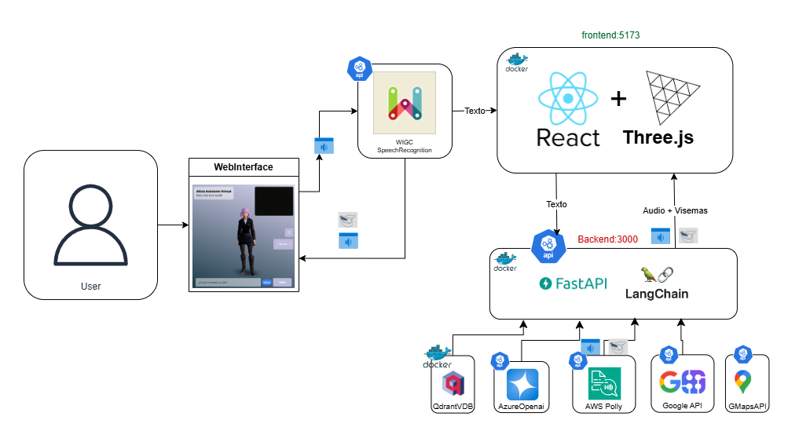

# de_avatar_lowpoly

Demo avatares en 3d node.js

## Descripción del Proyecto

Este repositorio contiene el backend y frontend para desplegar una aplicación de un avatar inteligente llamado **Ingrid**, impulsado por modelos de lenguaje y de text2speech.

## Diagrama de conversación



## Características

- **Impulsado por modelos de Lenguaje (framwoerk langchain)**: Versatilidad para el uso de distintos proveedores de IA.
- **Interacción en tiempo real**: Ingrid puede responder a preguntas y mantener conversaciones.
- **Conversión de texto a voz**: Utiliza servicios de SpeechServices de azure para generar respuestas de voz.
- **Herramientas extra para mejorar la usabilidad**: Uso de herramientas y APIs externas como mapas y noticias.
- **Integración con una base de conocimiento para RAG**: Interfaz de usuario intuitiva y agradable.

## Prerrequisitos

Si se desea un entorno de desarrollo local es necesario tener conocimiento de Node.js (React) y Python (Flask).

**Necesario**: Actualmente el proveedor de LLM es Azure OpenAI, por lo que se requiere un recurso de Azure OpenAI para poder utilizar la aplicación. Además para la generación de voz, el proveedor es SpeechServices de azure aunque tambien esta diponible el servicio de AWS Polly (Actualmente sin uso); por lo que si se opta por este ultimo, se requiere una cuenta de AWS y las credenciales correspondientes, con permisos para acceder a Polly text2speech y polly text2viseme.

**PARA USO DE MODELO DE LENGUAJE DE OPENAI**: Para desplegar la aplicación en Docker, se requieren las siguientes credenciales / Variables de entorno:

- `AZURE_OPENAI_API_KEY`: Clave de API del servicio de AZURE OpenAI.
- `AZURE_OPENAI_ENDPOINT`: Endpoint del servicio de AZURE OpenAI.
- `DEPLOYMENT_NAME`: Nombre del despliegue del modelo en azure.
- `MODEL_NAME`: Nombre del modelo en azure.
- `OPENAI_API_VERSION`: Versión de la API de OpenAI.

**Servicio de SpeechServices de azure** Se necesita las siguientes credenciales de azure con el servicio ya creado

- `AZURE_SPEECH_KEY`: Clave de acceso de Azure.
- `AZURE_SPEECH_VOICE`: Tipo de voz del agente.
- `AZURE_SPEECH_REGION`: Región de Azure (Nota: se recomienda que se encuentre en la misma region que el resto de los recursos).

**Servicio de Text2Speech y Visemas**: Si se vota por AWS para la generación de voz y visemas para animación de boca del avatar, se hace uso de AWS Polly. Por lo que se requieren las siguientes credenciales de un rol IAM de AWS, con los permisos correspondientes para acceder a Polly text2speech y polly text2viseme.

- `AWS_ACCESS_KEY_ID`: ID de acceso de AWS.
- `AWS_SECRET_ACCESS_KEY`: Clave de acceso secreta de AWS.
- `AWS_REGION`: Región de AWS.

**PARA USO DE APIS EXTERNAS**: Actualmente se utilizan APIs de Google Maps y GoogleSearch. Para ello se requieren las siguientes credenciales:

- `MAPS_API_KEY`: Clave de API de Google Maps (actualmente se debe obtener un permiso desde un [proyecto de GCP](https://console.cloud.google.com/google/maps-apis/home?project=solid-box-426300-c3&referrer=search)).
- `SERPAPI_API_KEY`: Clave de API de Google Search. Se obtiene a través de [SerpAPI](https://serpapi.com/).

**PARA USO DE BASE DE CONOCIMIENTO PARA RAG**: Si se desea integrar una base de conocimiento, se necesitan tres componentes extra; Una base de datos vectorial (Actualmente implementada con Qdrant), modelos de embeddings y una fuente de datos para hacer el ingreso a la base de datos. El modelo de Embeddings que actualmente se utiliza también es provisto por OpenAI. Y la fuente de datos es un Blob Storage de Azure. **estos elementos se pueden sustituír o excluír; pero habrá que hacer modificaciones en el código para ello.**

**Modelo de EMbeddings**:

- `EMBEDDINGS_MODEL`: Nombre del modelo de embeddings en azure.
  **Datos de la base de Qrant**
- `QDRANT_HOST`: Host de la base de datos vectorial.
- `QDRANT_PORT`: Puerto de la base de datos vectorial.
- `QDRANT_COLLECTION_NAME`: Nombre de la colección en la base de datos vectorial.
  **Fuente de datos (AZURE STORAGE)**
- `AZURE_STORAGE_ACCOUNT_NAME`: Nombre de la cuenta de almacenamiento de Azure.
- `AZURE_STORAGE_ACCOUNT_KEY`: Clave de la cuenta de almacenamiento de Azure.
- `BLOB_NAME`: Nombre del blob en el contenedor de Azure. (no se usa esta variable)
- `AZURE_CONTAINER_NAME`: Nombre del contenedor de Azure.
- `DOWNLOAD_DIR`: Directorio de descarga de los datos.

* El core de configuración de las herramientas extra se encuentra en los archivos `de_avatar_lp_backend/agents.py`, y las funciones extras en `de_avatar_lp_backend/services/`

* Para la configuración de la descarga de archivos para la base de datos se encuentra en `de_avatar_lp_backend/services/rag_qdrant.py`; pero el instanciamiento del cliente y la revisión de la base de datos se encuentra en `de_avatar_lp_backend/api/endpoints/chat.py`, antes de la definición del endpoint principal de chat.

* La funcionalidad de mapas incluye la generación de un mapa con la ubicación de la dirección ingresada por el usuario. **Para ello el frontend también necesita un archivo de credenciales/variables de entorno**. Sin embargo si se inhabilita la capacidad de buscar en mapas, se puede eliminar la necesidad de las credenciales de Google Maps en el frontend.

### Uso de herramientas

Si se desea habilitar o inhabilitar alguna de las herramientas extra, se deben considerar los siguientes pasos:

1. El archivo `de_avatar_lp_backend/agents.py` contiene la definición de los diferentes agentes que orquestan el razonamiento y las capacidades del avatar. Para habilitar o inhabilitar alguna de las herramientas, se debe modificar este archivo.
2. En el archivo `de_avatar_lp_backend/templates/prompts_str.py` se encuentran los prompts para instruir a los agentes. Específicamente el prompt **classifier_prompt_str** instruye acerca de las herramientas que el avatar puede utilizar. Si se desea habilitar o inhabilitar alguna de las herramientas, se debe modificar este prompt.
3. En el archivo `de_avatar_lp_backend/api/endpoints/chat.py` se encuentra el flujo de desición del avatar. Al habilitar, pero principalmente al deshabilitar alguna de las herramientas, se debe modificar el flujo de desición del avatar. Este flujo comienza en:

   ```python
   case = PseudoAgentsIngrid.query_classifier(query=chat_request.message)
   print(case)
   try:
       option_bools[case] = True
   ```

**Servicio de OCR de azure**: Para leer los documentos de azure que tengan imagenes se utilizo el servicio de azure llamado document intelligense, para eston necesarios las siguientes variables de entorno:

- `AZURE_DOCUMENT_INTELLIGENCE_ENDPOINT`: Endpoint de azure para usar el servicio de document intelligence.
- `AZURE_DOCUMENT_INTELLIGENCE_KEY`: Clave de API de document intelligence de azure.

### Uso actual

Actualmente se esta trabajando en el desarrollo de una POC para desarrollan un agente como profesor/guia estudiantil que consulta informacion del RAG que esta constituido por documentos de materias de matematica y lengua con lo cual muchas de las herramientas que se mencionarion no se estaran usando.

#### Herramientas desactivadas

Hay una lista de herramientas que ya fueron desactivadas ya que no tienen razon de ser para este desarrollo, entre ellas estan:

- `Trends`: Muestra las tendencias de Mexico
- `News`: Muestra las ultimas noticias de Mexico

## Instalación

### Pasos

**Importante** asegurarse de tener instalado y funcionando Docker.

1. Clonar el repositorio:
   ```bash
   git clone https://github.com/AI-LAB/de_avatar_lowpoly.git
   ```
2. Incluír los archivos de variables de entorno en los directorios correspondientes.
   - Para el backend, incluir el archivo `.env` en el directorio `de_avatar_lp_backend/`.
   - Para el frontend, incluir el archivo `.env` en el directorio `de_avatar_lp_frontend/`.
     En las respectias ubicaciones se puede encontrar el env.example para guiar la creación de las variables de entorno.
3. Navegar al directorio del proyecto:
   ```bash
   cd de_avatar_lowpoly
   ```
4. Construir y levantar los contenedores Docker:
   ```bash
   docker-compose up --build
   ```

## Uso

Para iniciar la aplicación, ejecutar:

```bash
docker-compose up
```

La aplicación estará disponible en `http://localhost:5173`.

## Contribución

Las contribuciones son bienvenidas. Por favor, abre un issue o un pull request para discutir cualquier cambio.

## Recursos

- [Documentación de Node.js](https://nodejs.org/es/docs/)
- [Documentación de Docker](https://docs.docker.com/)
- [API de AWS Polly](https://docs.aws.amazon.com/polly/latest/dg/what-is.html)
- [API de Google Maps](https://developers.google.com/maps/documentation/javascript/overview)
- [API de Google Search](https://serpapi.com/)
- [API de Azure OpenAI](https://azure.microsoft.com/es-es/products/ai-services/openai-service/?msockid=096b93f1b61569eb0551875bb72768a4)
- [Documentación de Azure Blob Storage](https://docs.microsoft.com/en-us/azure/storage/blobs/)

## Estructura del proyecto

```
├── de_avatar_lp_backend/
    │
    ├── api/
    │   ├── endpoints/
    │   │   ├── __init__.py
    │   │   ├── chat.py
    │   │   └── voices.py
    │
    ├── core/
    │   ├── config.py
    │   └── logging_config.py
    │
    ├── services/
    │   ├── openai_service.py
    │   ├── elevenlabs_service.py
    │   └── lip_sync_service.py
    │
    ├── templates/
    │   └── sys_message.py
    │
    ├── utils/
    │   └── audio_utils.py
    │
    ├── audios/
    ├── .env
    ├── main.py
    ├── README.md
    └── requirements.txt
├── de_avatar_lp_frontend/
├── .gitignore
├── backend.dockerfile
├── frontend.dockerfile
├── docker-compose.yml
├── README.md
```

```
+---de_avatar_lp_frontend
    |   .env
    |   index.html
    |   package-lock.json
    |   package.json
    |   postcss.config.js
    |   README.md
    |   tailwind.config.js
    |   vite.config.js
    |   yarn.lock
    |
    +---public
    |   |   favicon.ico
    |   |   vite.svg
    |   |
    |   +---animations
    |   |       Angry.fbx
    |   |       Crying.fbx
    |   |       Laughing.fbx
    |   |       Rumba Dancing.fbx
    |   |       Standing Idle.fbx
    |   |       Talking_0.fbx
    |   |       Talking_1.fbx
    |   |       Talking_2.fbx
    |   |       Terrified.fbx
    |   |
    |   \---models
    |           64f1a714fe61576b46f27ca2.glb
    |           animations.glb
    |           rpm.fbx
    |
    \---src
        |   App.jsx
        |   index.css
        |   main.jsx
        |
        +---assets
        |       react.svg
        |
        +---components
        |       AudioInput.jsx
        |       Avatar.jsx
        |       BackgroundSelector.jsx
        |       CameraComponent.jsx
        |       Experience.jsx
        |       GeolocationGetter.jsx
        |       MapComponent.jsx
        |       UI.jsx
        |
        \---hooks
                useChat.jsx
```


# USO LOCAL
## EJECUCION LOCAL

### directorio de trabajo 
cd directorio_del_proyecto
code .                      :: ejecuta en ambiente CMD VSC 

### contruccion de ambien
docker-compose up --build   :: contruye contenedores | si se actualizar algun archivo de la carpeta frontend deberia ejecutarce este
docker-compose up           :: carga contenedores

## Si se requiere reconstruis ambien completo
docker-compose down --rmi all --volumes --remove-orphans 
docker-compose up --build
