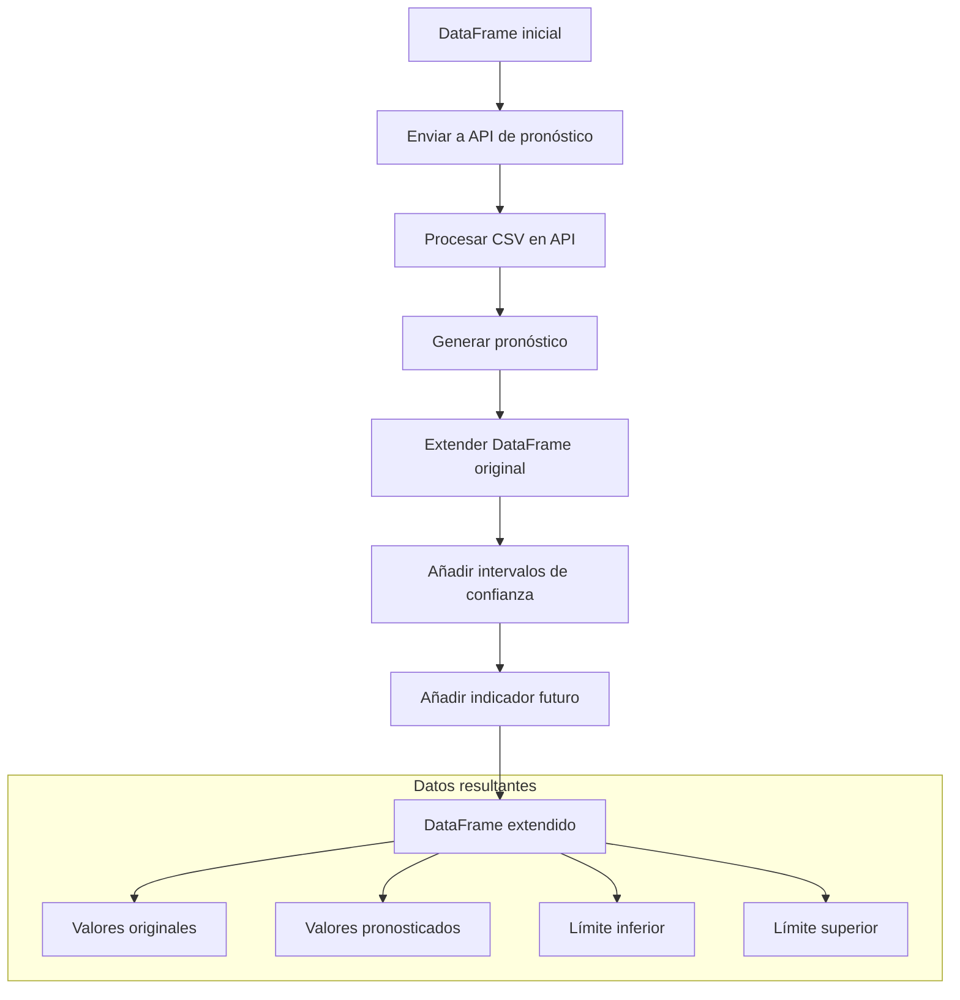
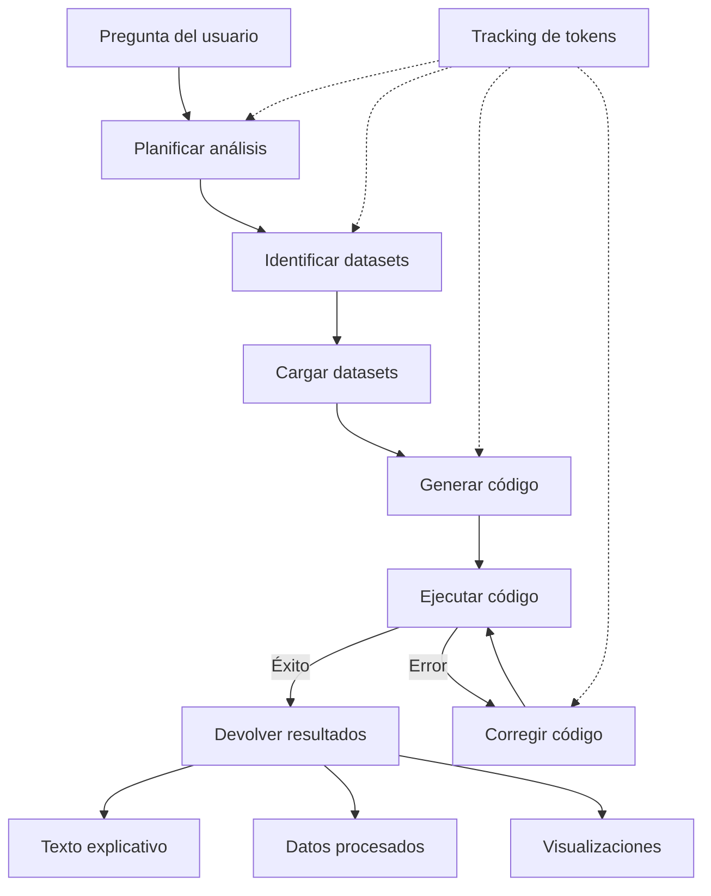
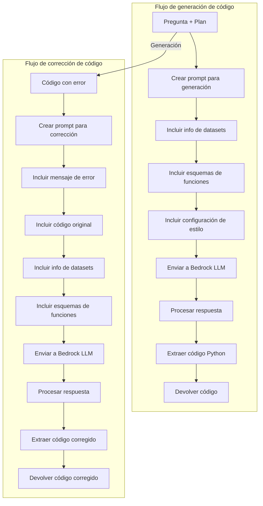
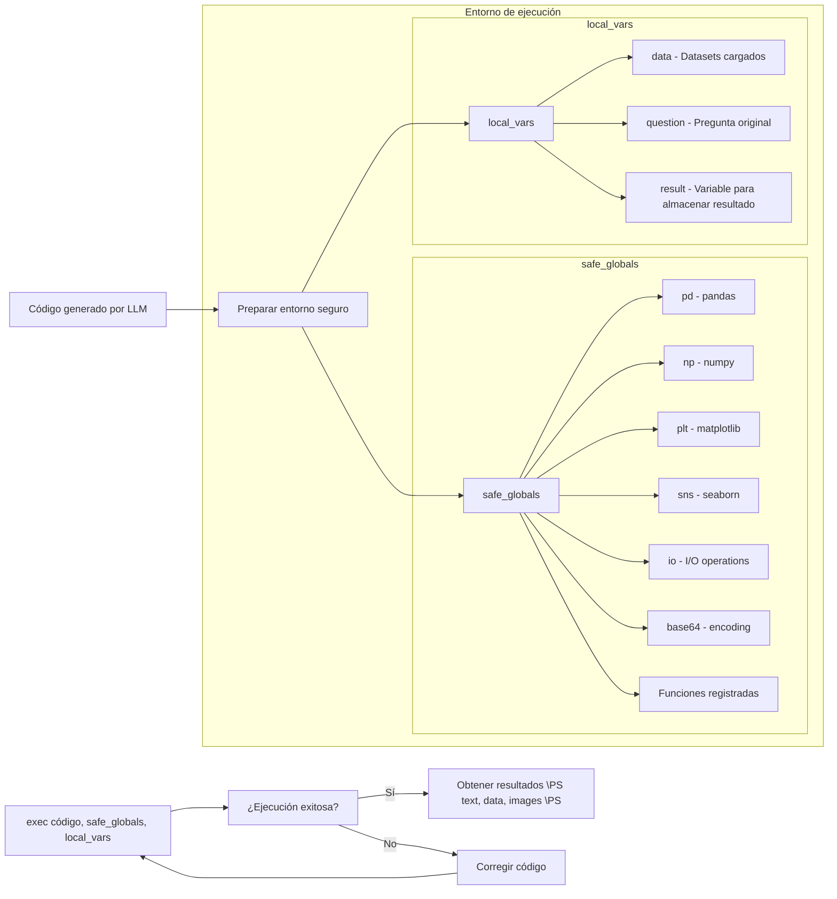

# 📊 DataAnalysisFlow

## 📋 Introducción

DataAnalysisFlow es una clase diseñada para potenciar análisis de datos utilizando Modelos de Lenguaje Grande (LLMs) como asistentes inteligentes. El flujo de trabajo es el siguiente:

1. **Recibe una pregunta** del usuario sobre datos
2. **Identifica automáticamente** qué datasets son necesarios para responderla
3. **Planifica** un enfoque de análisis estructurado
4. **Genera código Python** optimizado para realizar el análisis
5. **Ejecuta el código** en un entorno controlado y seguro
6. Si hay errores, **corrige el código** automáticamente
7. **Devuelve resultados** en formato estructurado con texto explicativo, datos procesados y visualizaciones

Todo este proceso utiliza Amazon Bedrock como motor de LLM para los pasos de planificación, identificación de datasets, generación y corrección de código.

## ⚠️ Prerequisitos

### Dependencias

```bash
# Instala las dependencias requeridas
pip install pandas numpy matplotlib seaborn requests boto3
```

### Variables de entorno

```bash
# Amazon Bedrock
export AWS_ACCESS_KEY_ID=tu_clave_de_acceso
export AWS_SECRET_ACCESS_KEY=tu_clave_secreta
export AWS_REGION=tu_region

# API de pronósticos (opcional)
export FORECAST_API_URL=url_del_servicio_de_pronóstico
```

## 🚀 Requisitos y puesta en marcha

### Inicialización básica

```python
from DataAnalyst import DataAnalysisFlow
import boto3

# Inicializar cliente de Bedrock
bedrock_client = boto3.client(
    service_name='bedrock-runtime',
    region_name='us-west-2'
)

# Inicializar el flujo de análisis de datos
data_analysis = DataAnalysisFlow(
    llm_client=bedrock_client,
    bedrock_model_id="anthropic.claude-3-haiku-20240307-v1:0",
    data_directory="./data",
    forecast_api_url="https://api.ejemplo.com/forecast", # Opcional
    forecast_api_key="tu_api_key", # Opcional
    track_tokens=True
)

# Procesar una pregunta
resultado = data_analysis.process_question(
    question="¿Cuál es la tendencia de ventas en los últimos 3 meses?",
    additional_context="Enfócate en productos de la categoría electrónicos"
)

# Acceder a los resultados
texto_explicativo = resultado['text']
datos_procesados = resultado['data']
visualizaciones = resultado['images']
```

### Configuración de estilo

```python
# Configurar estilo de visualizaciones
style_config = {
    "color_palette": ["#1f77b4", "#ff7f0e", "#2ca02c", "#d62728", "#9467bd"],
    "plot_style": "sns.set_style('darkgrid')",
    "font_family": "Arial",
    "chart_type_preference": "seaborn"
}

data_analysis.update_style_config(style_config)
```

### Registrar funciones personalizadas

```python
def calcular_elasticidad(df, col_precio, col_demanda):
    """
    Calcula la elasticidad precio-demanda.
    
    Args:
        df (pd.DataFrame): DataFrame con datos de precio y demanda
        col_precio (str): Nombre de la columna de precio
        col_demanda (str): Nombre de la columna de demanda
        
    Returns:
        pd.DataFrame: DataFrame con elasticidad calculada
    """
    # Lógica para calcular elasticidad
    return df_resultado

# Registrar la función
data_analysis.register_custom_function(
    calcular_elasticidad,
    description="Calcula la elasticidad precio-demanda",
    parameters={
        "df": {
            "type": "pd.DataFrame",
            "description": "DataFrame con datos de precio y demanda",
            "required": True
        },
        "col_precio": {
            "type": "str",
            "description": "Nombre de la columna de precio",
            "required": True
        },
        "col_demanda": {
            "type": "str",
            "description": "Nombre de la columna de demanda",
            "required": True
        }
    },
    returns={
        "type": "pd.DataFrame",
        "description": "DataFrame con elasticidad calculada"
    }
)
```

## 🔄 Integraciones

### Función de pronóstico integrada

La clase incluye por defecto una función de pronóstico de series temporales. Esta función permite extender un DataFrame con valores pronosticados.

```python
# Ejemplo de uso dentro del código generado
df_extendido = generate_forecast(
    data=df,
    target_column='ventas',
    date_column='fecha',
    prediction_length=30
)
```

La función `generate_forecast` devuelve un DataFrame extendido con las siguientes columnas:
- `target_column`: La columna original con valores pronosticados al final
- `date_column`: Fechas extendidas al futuro
- `future_assigned`: Booleano que indica si el valor es un pronóstico (True) o dato real (False)
- `lower_quantile`: Límite inferior del intervalo de confianza
- `upper_quantile`: Límite superior del intervalo de confianza



### Estructura para añadir funciones personalizadas

Para registrar funciones personalizadas, debe seguir esta estructura:

```python
data_analysis.register_custom_function(
    func=mi_funcion,                  # La función a registrar
    description="Descripción clara",  # Descripción para el LLM
    parameters={                      # Esquema de parámetros
        "param1": {
            "type": "tipo",           # Tipo de datos
            "description": "desc",    # Descripción del parámetro
            "required": True/False    # Si es obligatorio
        },
        # Más parámetros...
    },
    returns={                         # Esquema de valor de retorno
        "type": "tipo_retorno",
        "description": "descripción_retorno"
    }
)
```

### Métodos principales disponibles

- `process_question(question, additional_context=None, style_override=None)`: Procesa una pregunta y devuelve resultados
- `update_style_config(new_style_config)`: Actualiza la configuración de estilo para visualizaciones
- `register_custom_function(func, description, parameters, returns)`: Registra una función personalizada
- `get_available_datasets()`: Obtiene información sobre los datasets disponibles
- `get_available_functions()`: Obtiene información sobre las funciones disponibles
- `get_token_usage()`: Obtiene estadísticas de uso de tokens
- `reload_datasets()`: Vuelve a cargar los datasets del directorio de datos

## 📊 Diagramas de flujo

### Flujo principal (process_question)



### Flujo de generación y corrección de código


## 📂 Estructura del módulo

```
DataAnalyst/
├── __init__.py
├── DataAnalyst.py           # Clase principal DataAnalysisFlow
├── prompts.py               # Plantillas de prompts para el LLM
├── utils/
│   ├── __init__.py
│   ├── bedrock_helpers.py   # Utilidades para Amazon Bedrock
│   └── function_schemas.py  # Registro y esquemas de funciones
└── forecasting/
    ├── __init__.py
    └── forecast_client.py   # Cliente para API de pronósticos
```

## ⚠️ Consideraciones importantes




1. **Seguridad**: El código generado se ejecuta en un entorno controlado con acceso limitado a funciones específicas.

2. **Formato de datos**: Las visualizaciones se generan en formato base64 y los datos en formato JSON orientado a registros.

3. **Robustez**: El sistema intenta corregir automáticamente errores en el código hasta 3 veces antes de fallar.

4. **Consumo de tokens**: Se realiza un seguimiento del uso de tokens para optimizar costos.

5. **Estilos**: La configuración de estilo permite personalizar las visualizaciones generadas.

## 📌 Ejemplos de uso

### Análisis básico

```python
resultado = data_analysis.process_question(
    question="¿Cuál es el promedio de ventas mensuales por categoría?"
)
```

### Análisis con contexto adicional

```python
resultado = data_analysis.process_question(
    question="¿Cuál es la tendencia de crecimiento?",
    additional_context="Considera solo los últimos 6 meses y enfócate en la región Norte."
)
```

### Análisis con estilo personalizado para esta pregunta

```python
estilo_personalizado = {
    "color_palette": ["#2c3e50", "#e74c3c", "#3498db", "#f1c40f", "#1abc9c"],
    "plot_style": "sns.set_style('whitegrid')"
}

resultado = data_analysis.process_question(
    question="Genera un dashboard con KPIs de ventas",
    style_override=estilo_personalizado
)
```